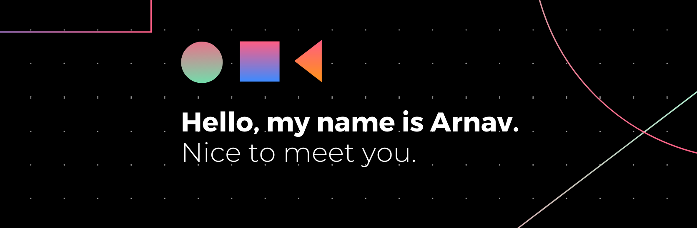

 

### Hi, I’m Arnav Dixit  
- 🎓 Undergraduate at NIT Bhopal, majoring in Computer Science 
- 🔭 Currently I'm working on some side projects and libraries
- 🌱 I’m always ready to collaborate and contribute
-  🖥 Enhancing my Competitive Programming skills
- 💬 Brainstorm with me over tech, algorithms and music
- 📝 [Resume](http://bit.ly/arnavdixit)

